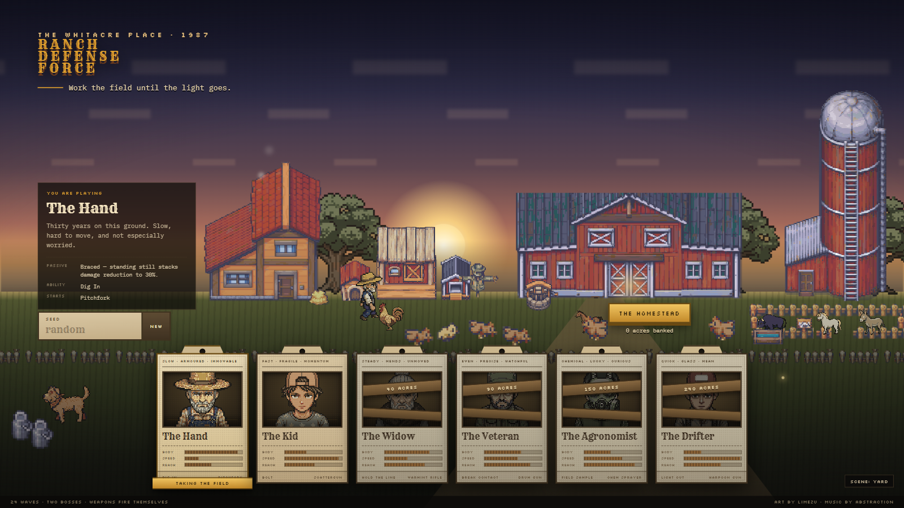
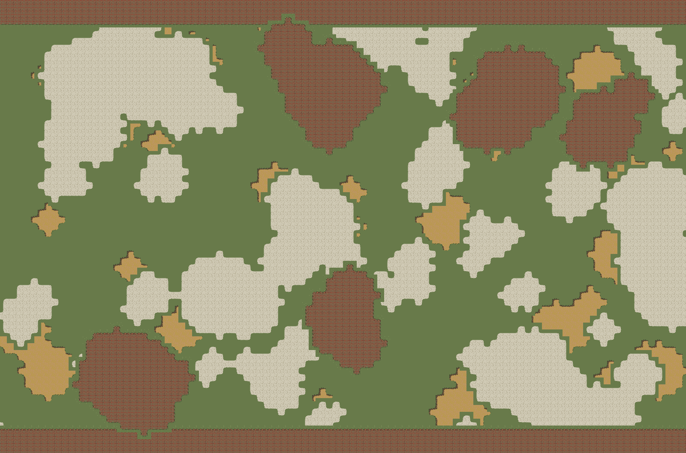
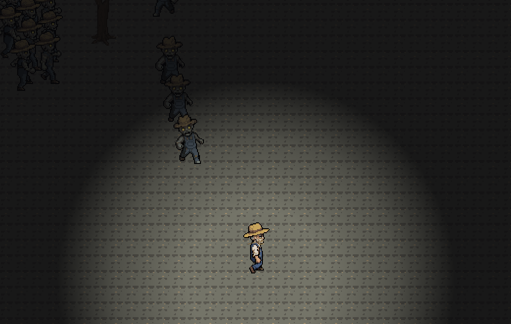
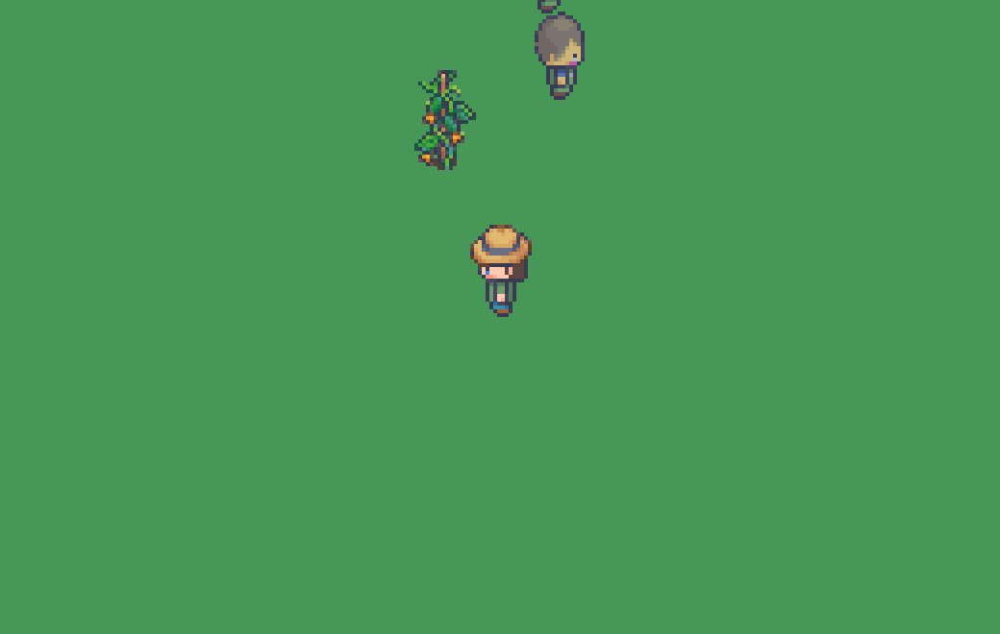

# Ranch Defense Force

**A wave-based bullet-heaven on a farm outside Canton, Ohio.** Something came
off the crop duster that went over low on Tuesday. Work the field until the
light goes — and when the ground starts to give, you can go down after it.

### ▶ [Play it in your browser](https://samizdat-publications.github.io/ranch-defense-force/)

TypeScript + Vite + Canvas 2D. No engine, no physics library, no UI framework,
no runtime dependencies at all.



---

## What a run is

Twenty-five waves, about seventeen minutes. Weapons fire themselves; you move,
you harvest, and you choose. Six classes, each built around a different answer
to "what do you do when the crowd arrives" — The Hand buys damage reduction by
standing still, The Kid scales damage with velocity, and a pilot that only ever
kites will tell you The Hand is the weaker class, which is a fact about the
pilot.

Between waves the field grows back a little, the shop opens, and **the ground
gets worse.** Ash spreads from wave 2 and has taken the field by 25 — a farm
turning to dust in daylight, which is the premise rather than a compromise with
it.

| | |
|---|---|
|  |  |
| **The Back Forty**, 3200×2100 — one of five arenas the seed picks between | **The Seam**, 1400×1000 — three levels underground, and the tightest arena in the game |

### The descent

From wave 10 a way down opens in the field. Stand on it, press **E**, and you
go under: The Root Cellar, then The Washout, then The Seam — each one smaller,
darker and worth more acres than the last. There is no way back up.

The fiction is the point. The dusters were not spraying the crops, they were
spraying to hold something down, and the blight spreads from below. So the hole
only opens once the field has already started going grey — a hole in a clean
field is a hole; a hole in a field that is already rotting is where the rot is
coming from.

**Nothing in `enemies.json` changes underground.** The caves are harder because
enemies spawn on arena edges and a small arena is a close one: the crowd is on
you immediately. Difficulty you can see the reason for.

---

## Running it

```bash
npm install
npm run atlas    # REQUIRED — builds public/atlas.png from assets/
npm run dev
```

`public/atlas.png` is **gitignored**: it is generated, and keeping it out is
what stops licensed art landing in a build output. A fresh clone renders
coloured squares until `npm run atlas` runs, by design — a missing atlas costs
the art, not the game.

`F1` toggles the dev overlay. `N` skips a wave.

| Command | What |
|---|---|
| `npm test` | 147 tests, including a headless full-run acceptance test |
| `npm run typecheck` | game and tools (separate tsconfigs) |
| `npm run atlas` | slice + pack `art/sprites.json` → `public/atlas.*` |
| `npm run shot` | headless screenshot of a real run — no browser |
| `npm run maps` | bake every arena whole, with per-layer coverage |
| `npm run balance` | 24 runs per configuration, with the numbers behind them |
| `npm run look` | sprites side by side; `--tile 5` is the only honest ground test |
| `npm run snap` | capture the screenshot archive in `docs/progress/` |

---

## How it is built

Six rules the whole thing rests on, all of them load-bearing:

- **A fixed 1/60s simulation step** with an accumulator; the renderer
  interpolates. Simulation is never tied to frame time.
- **Zero allocation in the hot loop.** Everything is pooled and reverse-iterated
  with swap-pop; nothing calls `.filter()` per frame.
- **All randomness goes through one seeded RNG**, so any run replays from its
  seed — and anything that must *not* move the run derives its own stream from
  the seed instead of drawing from it. The map choice, the terrain, the blight
  and the descent all do.
- **Stat resolution is one pass:** flat bonuses summed, percentages summed
  additively, applied once. No multiplicative stacking anywhere.
- **Sim and render never import each other's internals.**
- **Every tunable number lives in `src/content/*.json`.** No balance constants
  in code — and a count that scales with the arena is a *density*, not a
  headcount.

## The art

Most of it is ours now, generated with [PixelLab](https://pixellab.ai) against a
written house style (`docs/ART_STYLE.md`): all six classes, every enemy, the
field animals, the trees and rocks and ore, the ground itself.

> **Licence.** What remains from the [LimeZu](https://limezu.itch.io) packs in
> `assets/` is commercially licensed. **This repository is public by specific
> permission from LimeZu; that permission does not travel** — please don't lift
> `assets/` into your own project or republish the packs. Only the packed atlas
> ever ships, which is the "edit and use the asset in a project" the licence
> allows. See [ASSETS.md](ASSETS.md).

Music by Abstraction. UI from LimeZu's interface pack, credited in-game as its
licence requires.

## Where it started



That is 2026-08-11 — one farmer, one zombie, one crop, on flat green.
Reconstructed by building that commit and re-shooting it, because nothing was
kept at the time. [`docs/progress/LOG.md`](docs/progress/LOG.md) is the whole
visual record.

---

## Reading the repo

**Start with [HANDOFF.md](HANDOFF.md).** It is the front door and it names the
reading order.

| | |
|---|---|
| [`HANDOFF.md`](HANDOFF.md) | the front door: state, the rules that have cost real time, what is outstanding |
| [`NOTES.md`](NOTES.md) | session by session, what was built and every bug that cost time. Long, and worth it |
| [`docs/NEXT_SESSION.md`](docs/NEXT_SESSION.md) | what to do next and in what order |
| [`docs/ART_STYLE.md`](docs/ART_STYLE.md) | the house style every asset is generated against |
| [`docs/DESIGN_STATE.md`](docs/DESIGN_STATE.md) | the current state of the UI |
| [`docs/progress/LOG.md`](docs/progress/LOG.md) | every screenshot, dated, back to the first one |
| [`CLAUDE.md`](CLAUDE.md) | the conventions and the non-negotiables |

Built with [Claude Code](https://claude.com/claude-code).
