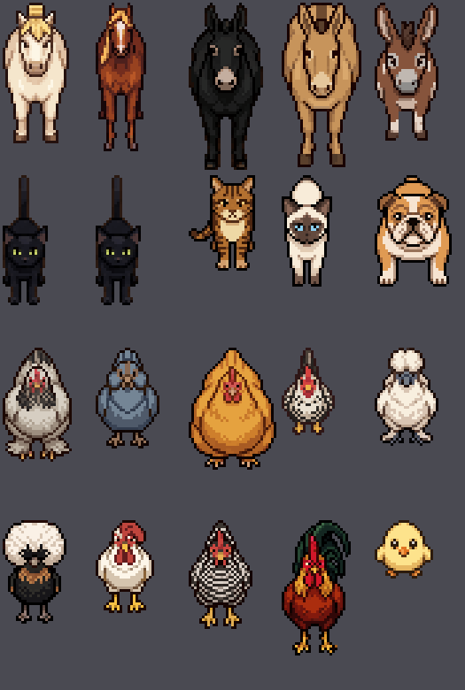
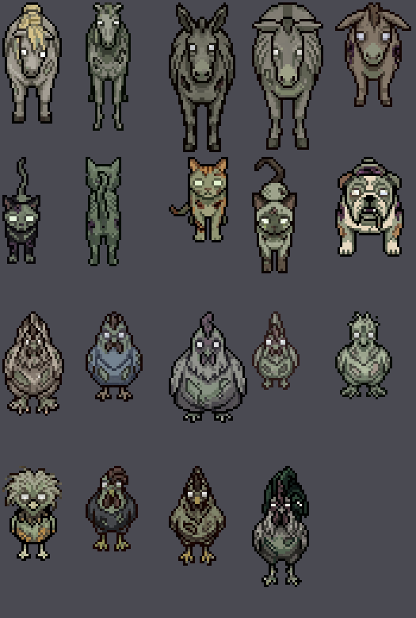
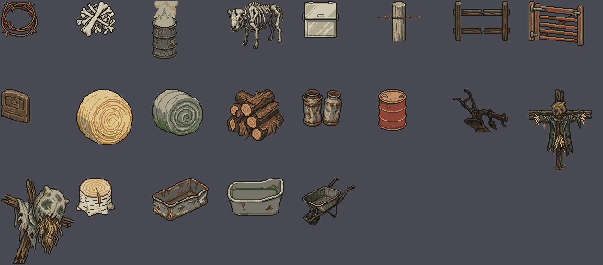
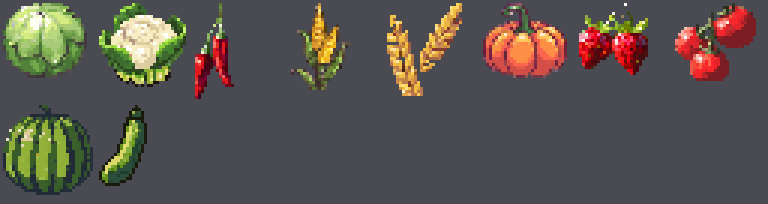
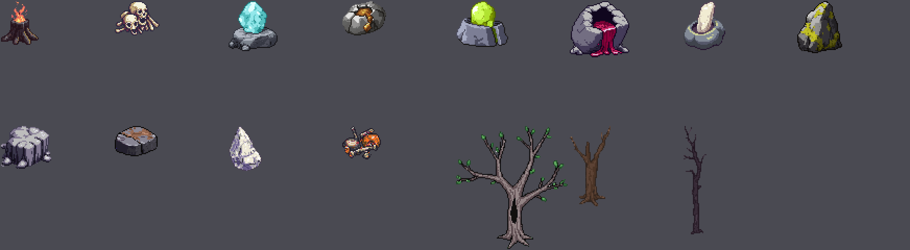
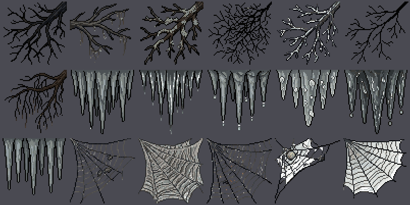
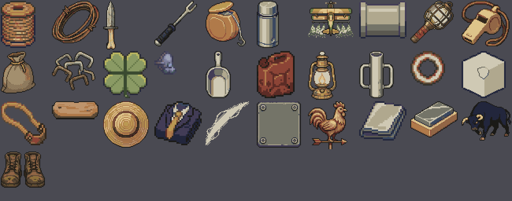

# Asset catalog — what a scene can draw

**Generated by `npm run catalog`. Do not hand-edit.**

5657 frame keys in `public/atlas.png`.

This is not `docs/PIXELLAB_INVENTORY.md`. That one lists what the PixelLab
account holds and answers *"have we already generated this?"*. **This one lists
what is packed and drawable**, and answers *"what can I put on screen?"* — a
uuid is not an atlas key, and a scene can only draw atlas keys.

## How to draw one

```ts
spriteEl('scene.barn', 400)                    // key, box size
spriteEl('rosie.idle.downRight', 96)           // any sheet, any facing
clipActor('brahmaHen', 'peck', 'down', x, y, '1.4s', 2)   // ANIMATED
```

`clipActor` composes the strip at runtime from frames already in the atlas,
so any clip listed below can be animated with no new art and no atlas growth.
Ask `clipsOf(sheet)` at runtime for the same table printed here.

**Eight facings** on every animal sheet: `down`, `downLeft`, `left`, `upLeft`,
`up`, `upRight`, `right`, `downRight`. Use them. A yard where every animal
faces the camera is a lineup, not a farm.

## The cast — the owner's own farm





Nineteen have a blighted twin made as a *state* of the same object, so the
twin is provably the same animal gone wrong — same pose, same size, same
canvas. A cross-fade between `x.idle.down.0` and `xBlight.idle.down.0` lands
with nothing to re-register. That is what makes the corruption cut cheap.

| clean | blighted | animated clips | who |
|---|---|---|---|
| `fjordPony` | `fjordPonyBlight` | graze (9f) | white thick Fjord pony, blonde mane |
| `arabian` | `arabianBlight` | *static* | Arabian, brown with a golden mane |
| `blackMule` | `blackMuleBlight` | *static* | the black charge mule |
| `beigeMule` | `beigeMuleBlight` | *static* | the beige charge mule |
| `rosie` | `rosieBlight` | *static* | Rosie — small brown-and-white mule/donkey |
| `wiz` | `wizBlight` | *static* | Wiz — black cat, GREEN eyes |
| `ouiji` | `ouijiBlight` | *static* | Ouiji — black cat, YELLOW-GREEN eyes |
| `tabbyCat` | `tabbyCatBlight` | *static* | the brown tabby |
| `siameseCat` | `siameseCatBlight` | *static* | the white siamese |
| `joy` | `joyBlight` | attack (9f), sit (9f) | Joy — tan-and-white bulldog, the level-up companion |
| `brahmaHen` | `brahmaHenBlight` | peck (9f) | light Brahma, feathered feet |
| `beardedHen` | `beardedHenBlight` | *static* | bearded Ameraucana, slate blue |
| `buffHen` | `buffHenBlight` | *static* | buff Orpington — the big one |
| `bantamHen` | `bantamHenBlight` | *static* | bantam — the small one |
| `silkieHen` | `silkieHenBlight` | *static* | Silkie — all puffy fur |
| `polishHen` | `polishHenBlight` | *static* | Polish crested — the enormous head puff |
| `leghornHen` | `leghornHenBlight` | *static* | white Leghorn, big floppy comb |
| `barredHen` | `barredHenBlight` | *static* | barred Plymouth Rock |
| `farmRooster` | `farmRoosterBlight` | *static* | the rooster, green-black sickle tail |
| `chick` | — | *static* | the yellow chick |

## Everything that can move

Every sheet with a multi-frame clip. `clipActor(sheet, clip, dir, ...)`.

| sheet | clips |
|---|---|
| `acidZombie` | walk (8f) |
| `agronomist` | walk (8f) |
| `arabianCursed` | attack (9f), hit (7f), death (9f), walk (9f) |
| `bantamHenBlight` | walk (9f) |
| `barnDog` | attack (9f), walk (9f) |
| `barredHenBlight` | walk (9f) |
| `beardedHenBlight` | walk (9f) |
| `bloatedFarmhand` | walk (8f) |
| `blownSheep` | death (9f), attack (9f), walk (9f) |
| `brahmaHen` | peck (9f) |
| `brahmaHenBlight` | walk (9f) |
| `buffHenBlight` | walk (9f) |
| `donkeyCursed` | death (9f), attack (9f), walk (9f) |
| `draftMuleCursed` | death (9f), attack (9f), hit (7f), walk (9f) |
| `drifter` | walk (8f) |
| `duckFlight` | walk (6f) |
| `duster` | walk (6f) |
| `farmhand` | walk (8f) |
| `feralDog` | death (9f), attack (9f), hit (7f), walk (9f) |
| `fjordPony` | graze (9f) |
| `fjordPonyCursed` | attack (9f), death (9f), walk (9f) |
| `fx.arrowImpact` | play (13f) |
| `fx.arrowImpact.acid` | play (13f) |
| `fx.arrowImpact.fire` | play (13f) |
| `fx.arrowImpact.frost` | play (13f) |
| `fx.bigImpact` | play (16f) |
| `fx.bigImpact.acid` | play (16f) |
| `fx.bigImpact.fire` | play (16f) |
| `fx.bigImpact.frost` | play (16f) |
| `fx.critStar` | play (12f) |
| `fx.dust` | play (9f) |
| `fx.explosion` | play (9f) |
| `fx.gas` | play (9f) |
| `fx.hitSpark` | play (8f) |
| `fx.muzzle` | play (8f) |
| `fx.shock` | play (9f) |
| `fx.shockwave` | play (5f) |
| `fx.slash` | play (8f) |
| `hand` | walk (8f) |
| `infectedHen` | attack (9f), hit (7f), death (9f), walk (9f) |
| `joy` | attack (9f), sit (9f) |
| `kid` | walk (8f) |
| `leghornHenBlight` | walk (9f) |
| `maskedHauler` | walk (8f) |
| `maskedSprayer` | walk (8f) |
| `polishHenBlight` | walk (9f) |
| `prizeBull` | death (9f), attack (9f), walk (9f) |
| `proj.claw` | play (12f) |
| `proj.crescent` | play (10f) |
| `proj.dart` | play (12f) |
| `proj.dart.acid` | play (12f) |
| `proj.dart.fire` | play (12f) |
| `proj.dart.frost` | play (12f) |
| `proj.glob` | play (8f) |
| `proj.glob.acid` | play (8f) |
| `proj.glob.fire` | play (8f) |
| `proj.glob.frost` | play (8f) |
| `proj.pellet` | play (12f) |
| `proj.pellet.acid` | play (12f) |
| `proj.pellet.fire` | play (12f) |
| `proj.pellet.frost` | play (12f) |
| `proj.seed` | play (8f) |
| `proj.seed.acid` | play (8f) |
| `proj.seed.fire` | play (8f) |
| `proj.seed.frost` | play (8f) |
| `proj.shard` | play (16f) |
| `proj.shell` | play (8f) |
| `proj.shell.acid` | play (8f) |
| `proj.shell.fire` | play (8f) |
| `proj.shell.frost` | play (8f) |
| `proj.slug` | play (10f) |
| `proj.slug.acid` | play (10f) |
| `proj.slug.fire` | play (10f) |
| `proj.slug.frost` | play (10f) |
| `proj.spear` | play (8f) |
| `proj.spear.acid` | play (8f) |
| `proj.spear.fire` | play (8f) |
| `proj.spear.frost` | play (8f) |
| `rooster` | attack (9f), death (9f), walk (9f) |
| `sickHog` | attack (9f), death (9f), walk (9f) |
| `silkieHenBlight` | walk (9f) |
| `vet` | walk (8f) |
| `whitacreBull` | attack (9f), walk (9f) |
| `widow` | walk (8f) |

## Baked strips — for `actor()`

Pre-baked horizontal strips from the LimeZu era. `clipActor` is the newer
path and covers everything above; these still work.

- `scene.calfGrazeStrip`
- `scene.chickPeckStrip`
- `scene.chickenPeckStrip`
- `scene.chickenWalkLeftStrip`
- `scene.cowGrazeStrip`
- `scene.dogIdleStrip`
- `scene.farmer2IdleBreatheStrip`
- `scene.farmerIdleBreatheStrip`
- `scene.farmerWalkStrip`
- `scene.farmerWalkUpStrip`
- `scene.roosterCrowStrip`
- `scene.roosterPeckStrip`
- `scene.roosterWalkStrip`
- `scene.scarecrowSwayStrip`
- `scene.sheepGrazeStrip`

## Buildings and yard furniture — 46


| key | size |
|---|---|
| `scene.barn` | 480x224 |
| `scene.calf` | 52x40 |
| `scene.calfGrazeStrip` | 468x40 |
| `scene.chick` | 32x32 |
| `scene.chickPeckStrip` | 288x32 |
| `scene.chickenPeckStrip` | 128x32 |
| `scene.chickenWalkLeftStrip` | 192x32 |
| `scene.coop` | 128x160 |
| `scene.cow` | 90x54 |
| `scene.cowGrazeStrip` | 810x54 |
| `scene.dogIdleStrip` | 540x42 |
| `scene.dogLab` | 60x42 |
| `scene.doghouse` | 64x96 |
| `scene.farmer2Idle` | 32x64 |
| `scene.farmer2IdleBreatheStrip` | 224x64 |
| `scene.farmerIdle` | 32x64 |
| `scene.farmerIdleBreatheStrip` | 224x64 |
| `scene.farmerWalkStrip` | 192x64 |
| `scene.farmerWalkUpStrip` | 192x64 |
| `scene.fencePicket` | 96x32 |
| `scene.fenceRail` | 64x96 |
| `scene.hay` | 64x32 |
| `scene.house` | 256x320 |
| `scene.milkcan` | 24x32 |
| `scene.nest` | 64x96 |
| `scene.oak` | 59x54 |
| `scene.penC1` | 32x26 |
| `scene.penGate` | 32x26 |
| `scene.penH` | 24x26 |
| `scene.penV` | 16x32 |
| `scene.rooster` | 54x62 |
| `scene.roosterCrowStrip` | 486x62 |
| `scene.roosterPeckStrip` | 486x62 |
| `scene.roosterWalkStrip` | 486x62 |
| `scene.scarecrow` | 96x96 |
| `scene.scarecrowSwayStrip` | 672x96 |
| `scene.sheep` | 52x34 |
| `scene.sheepGrazeStrip` | 468x34 |
| `scene.signCow` | 32x30 |
| `scene.silo` | 224x448 |
| `scene.tractorLeft` | 160x114 |
| `scene.treeOak` | 250x212 |
| `scene.trough` | 64x32 |
| `scene.well` | 96x64 |
| `scene.wheat` | 32x32 |
| `scene.wheat2` | 32x32 |

## Field props — many with 16 variants each — 21



| key | size |
|---|---|
| `prop.barbedWire` | 40x39 |
| `prop.bonePile` | 43x39 |
| `prop.burnBarrel` | 29x63 |
| `prop.carcass` | 62x52 |
| `prop.feedBin` | 40x40 |
| `prop.fencePost` | 46x44 |
| `prop.fenceRail` | 62x44 |
| `prop.gate` | 60x49 |
| `prop.graveMarker` | 32x37 |
| `prop.hayBale` | 62x61 |
| `prop.hayBaleRotted` | 56x51 |
| `prop.logPile` | 62x56 |
| `prop.milkCans` | 43x41 |
| `prop.oilDrum` | 32x45 |
| `prop.plough` | 60x47 |
| `prop.scarecrow` | 69x88 |
| `prop.scarecrowRotted` | 80x94 |
| `prop.treeStump` | 42x43 |
| `prop.trough` | 62x47 |
| `prop.troughFouled` | 62x42 |
| `prop.wheelbarrow` | 57x52 |

## Crops, healthy and rotted — 10



| key | size |
|---|---|
| `crop.cabbage` | 28x25 |
| `crop.cauliflower` | 29x28 |
| `crop.chili` | 13x32 |
| `crop.corn` | 20x29 |
| `crop.grain` | 25x31 |
| `crop.pumpkin` | 28x25 |
| `crop.strawberry` | 23x24 |
| `crop.tomato` | 27x26 |
| `crop.watermelon` | 30x30 |
| `crop.zucchini` | 16x27 |

## Harvest nodes — rocks, trees, seams — 15



| key | size |
|---|---|
| `node.ashStump` | 36x42 |
| `node.boneHeap` | 43x33 |
| `node.oreBlue` | 47x48 |
| `node.oreBronze` | 42x33 |
| `node.oreGold` | 50x44 |
| `node.oreRed` | 57x54 |
| `node.oreSilver` | 40x47 |
| `node.rockBig` | 43x50 |
| `node.rockMedium` | 48x41 |
| `node.rockSmall` | 41x29 |
| `node.saltRock` | 32x43 |
| `node.scrapHeap` | 37x32 |
| `node.treeBig` | 107x118 |
| `node.treeMedium` | 39x77 |
| `node.treeSmall` | 22x104 |

## Cave and canopy art — 18



| key | size |
|---|---|
| `cave.branches0` | 64x64 |
| `cave.branches1` | 64x64 |
| `cave.branches2` | 64x64 |
| `cave.branches3` | 64x64 |
| `cave.branches4` | 64x64 |
| `cave.branches5` | 64x64 |
| `cave.branches6` | 64x64 |
| `cave.stalactite0` | 64x64 |
| `cave.stalactite1` | 64x64 |
| `cave.stalactite2` | 64x64 |
| `cave.stalactite3` | 64x64 |
| `cave.stalactite4` | 64x64 |
| `cave.stalactite5` | 64x64 |
| `cave.web0` | 64x64 |
| `cave.web1` | 64x64 |
| `cave.web3` | 64x64 |
| `cave.web4` | 64x64 |
| `cave.web5` | 64x64 |

## Item card art — 31



| key | size |
|---|---|
| `item.balingTwine` | 44x60 |
| `item.barbedWire` | 60x54 |
| `item.bootKnife` | 19x62 |
| `item.cattleProd` | 54x58 |
| `item.chalkLine` | 51x58 |
| `item.coffeeThermos` | 28x60 |
| `item.cropDuster` | 58x47 |
| `item.culvertPipe` | 60x48 |
| `item.ditchLight` | 55x54 |
| `item.dogWhistle` | 61x58 |
| `item.feedSack` | 44x54 |
| `item.fenceStaples` | 55x50 |
| `item.fourLeaf` | 56x60 |
| `item.gasMask` | 28x30 |
| `item.grainScoop` | 32x60 |
| `item.keroseneCan` | 48x60 |
| `item.lampOil` | 36x62 |
| `item.postDriver` | 44x60 |
| `item.saltCircle` | 44x44 |
| `item.saltLick` | 56x60 |
| `item.slingBands` | 58x56 |
| `item.splitRail` | 59x23 |
| `item.strawHat` | 58x59 |
| `item.sundayBest` | 60x56 |
| `item.threshingFloor` | 55x56 |
| `item.tractorPlate` | 56x59 |
| `item.weatherVane` | 50x61 |
| `item.wetRag` | 60x50 |
| `item.whetstone` | 60x46 |
| `item.whitacreBull` | 63x50 |
| `item.workBoots` | 56x46 |

