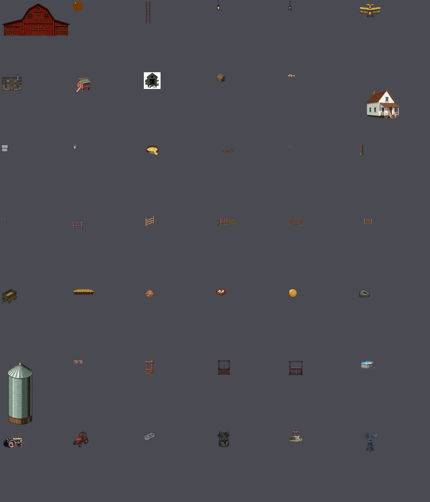

# Asset catalog — what a scene can draw

**Generated by `npm run catalog`. Do not hand-edit.**

8104 frame keys in `public/atlas.png`.

This is not `docs/PIXELLAB_INVENTORY.md`. That one lists what the PixelLab
account holds and answers *"have we already generated this?"*. **This one lists
what is packed and drawable**, and answers *"what can I put on screen?"* — a
uuid is not an atlas key, and a scene can only draw atlas keys.

## READ THIS FIRST — the art is not to scale

**Never draw a sprite at its source size.** Every animal is authored on the
game's 32x64 grid, because in the game every entity IS a grid cell. So:

| | source | | source |
|---|---|---|---|
| `wiz` — a cat | 16x42 | `hand` — a grown man | 30x52 |
| `brahmaHen` — a hen | 26x43 | `blackMule` — a mule | 28x63 |
| `joy` — a bulldog | 29x42 | `fjordPony` — a pony | 25x53 |

Six things within a few pixels of each other that are nothing like the same
size in life. Drawn 1:1 they are a row of identical silhouettes — which is
exactly what the first title screens came out as, with a bulldog the size of
a pony. The buildings are on a THIRD scale again: `ranch.barn` is 400px wide
and `ranch.windmill` 128, which are canvases and not content boxes at all.

So **every table below has a `draw at` column**, derived from what the thing
actually is against one reference:

> **A grown person is 64px tall.** That is 36.6px per metre.

Small animals sit deliberately above life scale — a cat at true scale is 9px
and unreadable — but the ORDER is always right: hen < dog < pony < barn. Use
the `draw at` number and the scene composes itself.

**Never infer height from the canvas.** The `ranch.*` group is packed
UNTRIMMED, so a frame rect is the generation canvas and the art floats inside
it: `ranch.farmhouse` is a 256x320 canvas holding 194x165 of house. Inferring
height from that canvas makes a 330-wide house 413 tall instead of 281, and the
farmhouse comes out taller than the barn. The `draw at` column gives BOTH
dimensions, measured off the alpha by `npm run scale`, and `content` is what was
measured.

**Where the art and the world disagree, the art wins.** An earlier version of
this table said `ranch.windmill` was 100 x 366, derived from a real Aermotor
being about 10m tall and 2.5m wide. The sprite is 68x115 — a ratio of 1.7, not
4 — so 366 stretched it. A stretched sprite is a visible defect; a short
windmill is a style choice. Wanting a taller one is a regeneration, not a
multiplier.

## How to draw one — USE THESE TWO, not `spriteEl`

```ts
sceneSprite('ranch.barn', 440)                        // exact height, on the ground
sceneSprite('rosie', 76, { facing: 'downRight' })     // any of the eight facings
groundActor('fjordPony', 'walk', 'left', x, footY, 96, '1.1s')   // ANIMATED
```

`sceneSprite` and `groundActor` (both from `src/ui/scene.ts`) do two things
`spriteEl` and `clipActor` deliberately do not, and both were bugs in the
first title screens:

**1. They hit the height you ask for.** `spriteEl` snaps to whole-pixel zoom,
which is right for a card and wrong here: every animal is authored on the
32x64 grid, so integer zoom pins them all to 1x and they all render at about
fifty pixels *whatever box you pass*. `spriteEl('joy', 40)` and
`spriteEl('fjordPony', 96)` come back 40px and 53px tall — a bulldog nearly
as tall as a pony, and no better numbers fix it because the numbers were
being ignored. `sceneSprite` scales fractionally and hits the number exactly.

**2. They put things on the ground.** Every sprite gets a soft contact
shadow, and `groundActor` positions by the FEET (`footY`), not the top.
*"Everything is in the air"* was the note the first screens came back with,
and one ellipse is the whole fix — the eye reads ground contact from the
shadow before it reads placement. `footY` is also the depth in a scene like
this, so `groundActor` sets `z-index` from it and back-to-front sorting is
free.

`spriteEl` and `clipActor` are still correct for CARDS, where every sprite
sits in its own fixed window and pixel purity is what matters.

`clipActor` composes the strip at runtime from frames already in the atlas,
so any clip listed below can be animated with no new art and no atlas growth.
Ask `clipsOf(sheet)` at runtime for the same table printed here.

**Eight facings** on every animal sheet: `down`, `downLeft`, `left`, `upLeft`,
`up`, `upRight`, `right`, `downRight`. Use them. A yard where every animal
faces the camera is a lineup, not a farm.

## The cast — the owner's own farm


Nineteen have a blighted twin made as a *state* of the same object, so the
twin is provably the same animal gone wrong — same pose, same size, same
canvas. A cross-fade between `x.idle.down.0` and `xBlight.idle.down.0` lands
with nothing to re-register. That is what makes the corruption cut cheap.

| clean | blighted | **draw at** | source | animated clips | who |
|---|---|---|---|---|---|
| `fjordPony` | `fjordPonyBlight` | **96px tall** | 25x53 | graze (9f), walk (9f) | white thick Fjord pony, blonde mane |
| `arabian` | `arabianBlight` | **104px tall** | 19x56 | graze (9f), walk (9f) | Arabian, brown with a golden mane |
| `blackMule` | `blackMuleBlight` | **100px tall** | 28x63 | walk (9f) | the black charge mule |
| `beigeMule` | `beigeMuleBlight` | **100px tall** | 30x62 | walk (9f) | the beige charge mule |
| `rosie` | `rosieBlight` | **76px tall** | 24x52 | graze (9f), walk (9f) | Rosie — small brown-and-white mule/donkey |
| `wiz` | `wizBlight` | **36px tall** | 17x49 | walk (9f) | Wiz — black cat, GREEN eyes |
| `ouiji` | `ouijiBlight` | **36px tall** | 16x42 | walk (9f) | Ouiji — black cat, YELLOW-GREEN eyes |
| `tabbyCat` | `tabbyCatBlight` | **36px tall** | 25x36 | walk (9f) | the brown tabby |
| `siameseCat` | `siameseCatBlight` | **36px tall** | 19x42 | walk (9f) | the white siamese |
| `joy` | `joyBlight` | **40px tall** | 29x42 | attack (9f), sit (9f), walk (9f) | Joy — tan-and-white bulldog, the level-up companion |
| `brahmaHen` | `brahmaHenBlight` | **40px tall** | 26x43 | peck (9f), walk (9f) | light Brahma, feathered feet |
| `beardedHen` | `beardedHenBlight` | **34px tall** | 24x38 | walk (9f) | bearded Ameraucana, slate blue |
| `buffHen` | `buffHenBlight` | **40px tall** | 33x46 | *static* | buff Orpington — the big one |
| `bantamHen` | `bantamHenBlight` | **26px tall** | 20x33 | *static* | bantam — the small one |
| `silkieHen` | `silkieHenBlight` | **30px tall** | 24x37 | walk (9f) | Silkie — all puffy fur |
| `polishHen` | `polishHenBlight` | **34px tall** | 24x39 | walk (9f) | Polish crested — the enormous head puff |
| `leghornHen` | `leghornHenBlight` | **36px tall** | 22x35 | walk (9f) | white Leghorn, big floppy comb |
| `barredHen` | `barredHenBlight` | **34px tall** | 24x41 | walk (9f) | barred Plymouth Rock |
| `farmRooster` | `farmRoosterBlight` | **46px tall** | 26x51 | walk (9f) | the rooster, green-black sickle tail |
| `chick` | — | **16px tall** | 22x22 | *static* | the yellow chick |

## Ambient loops — the scenes live on these

One-direction props that move on their own. A title screen is carried by the
things that move without being looked at, and these are the whole point of
the `sceneClips` block: they use the same keys as everything else, with the
single direction spelled `down`.

| sheet | clip | draw at | note |
|---|---|---|---|
| `windmill` | `spin` (9f) | **100 x 169** | blades turning. NOT `ranch.windmill`, which is the static one |
| `wheat` | `sway` (9f) | ~55 tall | a stand swaying in the breeze |
| `scarecrow` | `sway` (9f) | ~90 tall | shifting and sagging in the wind |

```ts
groundActor('windmill', 'spin', 'down', x, footY, 366, '1.4s')
```

**Watch the name collision.** `ranch.windmill` and `ranch.scarecrow` are the
STILL versions and they are what a scene gets if it asks for the `ranch.`
key. The moving ones have no prefix.

## Everything that can move

Every sheet with a multi-frame clip. `clipActor(sheet, clip, dir, ...)`.

| sheet | clips |
|---|---|
| `acidZombie` | walk (8f), hit (6f), death (7f) |
| `agronomist` | walk (8f) |
| `arabian` | graze (9f), walk (9f) |
| `arabianCursed` | walkHurt (9f), attack (9f), hit (7f), death (9f), walk (9f) |
| `bantamHenBlight` | walk (9f) |
| `barnDog` | attack (9f), walk (9f) |
| `barredHen` | walk (9f) |
| `barredHenBlight` | walk (9f) |
| `baseGuard` | walk (8f) |
| `baseHazmat` | walk (8f) |
| `baseTech` | walk (8f) |
| `beardedHen` | walk (9f) |
| `beardedHenBlight` | walk (9f) |
| `beigeMule` | walk (9f) |
| `blackMule` | walk (9f) |
| `bloatedFarmhand` | walk (8f), hit (6f), death (7f) |
| `blownSheep` | death (9f), walkHurt (9f), attack (9f), hit (7f), walk (9f) |
| `brahmaHen` | peck (9f), walk (9f) |
| `brahmaHenBlight` | walk (9f) |
| `buffHenBlight` | walk (9f) |
| `donkeyCursed` | death (9f), walkHurt (9f), attack (9f), hit (7f), walk (9f) |
| `draftMuleCursed` | death (9f), attack (9f), walkHurt (9f), hit (7f), walk (9f) |
| `drifter` | walk (8f) |
| `duckFlight` | walk (6f) |
| `duster` | walk (6f) |
| `farmRooster` | walk (9f) |
| `farmhand` | walk (8f), hit (6f), death (7f) |
| `feralDog` | death (9f), walkHurt (9f), attack (9f), hit (7f), walk (9f) |
| `fjordPony` | graze (9f), walk (9f) |
| `fjordPonyCursed` | walkHurt (9f), attack (9f), hit (7f), death (9f), walk (9f) |
| `fx.arrowImpact` | play (13f) |
| `fx.arrowImpact.acid` | play (13f) |
| `fx.arrowImpact.fire` | play (13f) |
| `fx.arrowImpact.frost` | play (13f) |
| `fx.bigImpact` | play (16f) |
| `fx.bigImpact.acid` | play (16f) |
| `fx.bigImpact.fire` | play (16f) |
| `fx.bigImpact.frost` | play (16f) |
| `fx.critStar` | play (12f) |
| `fx.dust` | play (9f) |
| `fx.explosion` | play (9f) |
| `fx.gas` | play (9f) |
| `fx.hitSpark` | play (8f) |
| `fx.muzzle` | play (8f) |
| `fx.shock` | play (9f) |
| `fx.shockwave` | play (5f) |
| `fx.slash` | play (8f) |
| `hand` | walk (8f) |
| `infectedHen` | attack (9f), walkHurt (9f), hit (7f), death (9f), walk (9f) |
| `joy` | attack (9f), sit (9f), walk (9f) |
| `kid` | walk (8f) |
| `labConsole` | flicker (9f) |
| `leghornHen` | walk (9f) |
| `leghornHenBlight` | walk (9f) |
| `maskedHauler` | walk (8f), hit (6f), death (7f) |
| `maskedSprayer` | walk (8f), hit (6f), death (7f) |
| `ouiji` | walk (9f) |
| `polishHen` | walk (9f) |
| `polishHenBlight` | walk (9f) |
| `prizeBull` | death (9f), walkHurt (9f), attack (9f), hit (7f), walk (9f) |
| `proj.claw` | play (12f) |
| `proj.crescent` | play (10f) |
| `proj.dart` | play (12f) |
| `proj.dart.acid` | play (12f) |
| `proj.dart.fire` | play (12f) |
| `proj.dart.frost` | play (12f) |
| `proj.glob` | play (8f) |
| `proj.glob.acid` | play (8f) |
| `proj.glob.fire` | play (8f) |
| `proj.glob.frost` | play (8f) |
| `proj.pellet` | play (12f) |
| `proj.pellet.acid` | play (12f) |
| `proj.pellet.fire` | play (12f) |
| `proj.pellet.frost` | play (12f) |
| `proj.seed` | play (8f) |
| `proj.seed.acid` | play (8f) |
| `proj.seed.fire` | play (8f) |
| `proj.seed.frost` | play (8f) |
| `proj.shard` | play (16f) |
| `proj.shell` | play (8f) |
| `proj.shell.acid` | play (8f) |
| `proj.shell.fire` | play (8f) |
| `proj.shell.frost` | play (8f) |
| `proj.slug` | play (10f) |
| `proj.slug.acid` | play (10f) |
| `proj.slug.fire` | play (10f) |
| `proj.slug.frost` | play (10f) |
| `proj.spear` | play (8f) |
| `proj.spear.acid` | play (8f) |
| `proj.spear.fire` | play (8f) |
| `proj.spear.frost` | play (8f) |
| `rooster` | attack (9f), walkHurt (9f), hit (7f), death (9f), walk (9f) |
| `rosie` | graze (9f), walk (9f) |
| `scarecrow` | sway (9f) |
| `siameseCat` | walk (9f) |
| `sickHog` | attack (9f), death (9f), walkHurt (9f), hit (7f), walk (9f) |
| `silkieHen` | walk (9f) |
| `silkieHenBlight` | walk (9f) |
| `tabbyCat` | walk (9f) |
| `tankBarrel` | swirl (9f) |
| `tankPanel` | churn (9f) |
| `tankSwirl` | swirl (9f), churn (9f) |
| `tankVat` | swirl (9f) |
| `vatSpecimen` | bubble (9f) |
| `vet` | walk (8f) |
| `wheat` | sway (9f) |
| `whitacreBull` | attack (9f), walk (9f) |
| `widow` | walk (8f) |
| `windmill` | spin (9f) |
| `wiz` | walk (9f) |

## Baked strips — for `actor()`

Pre-baked horizontal strips from the LimeZu era. `clipActor` is the newer
path and covers everything above; these still work.

- `scene.calfGrazeStrip`
- `scene.chickPeckStrip`
- `scene.chickenPeckStrip`
- `scene.chickenWalkLeftStrip`
- `scene.cowGrazeStrip`
- `scene.dogIdleStrip`
- `scene.farmer2IdleBreatheStrip`
- `scene.farmerIdleBreatheStrip`
- `scene.farmerWalkStrip`
- `scene.farmerWalkUpStrip`
- `scene.roosterCrowStrip`
- `scene.roosterPeckStrip`
- `scene.roosterWalkStrip`
- `scene.scarecrowSwayStrip`
- `scene.sheepGrazeStrip`

## THE RANCH — generated buildings, vehicles, fencing, feed. USE THESE. — 42



| key | canvas | content | **draw at (w x h)** |
|---|---|---|---|
| `ranch.barn` | 400x224 | 383x183 | **440 x 210** |
| `ranch.barnFloor` | 64x64 | 50x50 | **64 x 64** |
| `ranch.barnLadder` | 48x128 | 24x125 | **26 x 135** |
| `ranch.barnLantern` | 32x64 | 18x56 | **20 x 62** |
| `ranch.barnLanternDark` | 32x64 | 17x59 | **20 x 69** |
| `ranch.biplane` | 128x128 | 120x90 | **293 x 220** |
| `ranch.bunkhouse` | 128x128 | 113x91 | **256 x 206** |
| `ranch.coop` | 128x160 | 86x84 | **92 x 90** |
| `ranch.coopBroken` | 96x96 | 96x96 | **80 x 80** |
| `ranch.doghouse` | 64x64 | 52x53 | **44 x 45** |
| `ranch.eggClutch` | 48x32 | 45x18 | **26 x 10** |
| `ranch.farmhouse` | 256x320 | 194x165 | **330 x 281** |
| `ranch.feedBin` | 48x48 | 40x40 | **37 x 37** |
| `ranch.feedBucket` | 32x32 | 16x22 | **13 x 18** |
| `ranch.feedPan` | 96x64 | 70x52 | **58 x 43** |
| `ranch.fenceBroken` | 128x64 | 72x24 | **110 x 37** |
| `ranch.fenceCorner` | 32x32 | 32x19 | **20 x 12** |
| `ranch.fenceCornerPost` | 32x64 | 26x61 | **18 x 42** |
| `ranch.fencePost` | 32x32 | 22x15 | **20 x 14** |
| `ranch.fenceRail` | 64x96 | 64x43 | **73 x 49** |
| `ranch.fenceRailBroken` | 64x64 | 54x58 | **73 x 78** |
| `ranch.fenceRun` | 128x64 | 112x43 | **110 x 42** |
| `ranch.gateClosed` | 96x64 | 73x44 | **132 x 80** |
| `ranch.gateOpen` | 96x64 | 54x36 | **132 x 88** |
| `ranch.hayWagon` | 96x96 | 87x81 | **146 x 136** |
| `ranch.loftEdge` | 128x48 | 122x33 | **220 x 60** |
| `ranch.muckTracks` | 64x64 | 47x38 | **64 x 52** |
| `ranch.nestBox` | 64x48 | 60x43 | **40 x 29** |
| `ranch.roundBale` | 64x64 | 48x47 | **55 x 54** |
| `ranch.roundBaleRotted` | 64x64 | 62x45 | **55 x 40** |
| `ranch.silo` | 224x400 | 144x350 | **146 x 355** |
| `ranch.squareBales` | 64x32 | 56x21 | **37 x 14** |
| `ranch.stallDivider` | 64x96 | 55x89 | **60 x 97** |
| `ranch.stallFront` | 96x96 | 66x82 | **120 x 149** |
| `ranch.stallFrontBroken` | 96x96 | 96x82 | **120 x 103** |
| `ranch.stockTank` | 96x64 | 86x47 | **70 x 38** |
| `ranch.tractor` | 160x112 | 116x74 | **146 x 93** |
| `ranch.tractorRed` | 96x96 | 85x87 | **128 x 131** |
| `ranch.waterTrough` | 64x64 | 62x44 | **73 x 52** |
| `ranch.well` | 96x96 | 71x88 | **55 x 68** |
| `ranch.wellStone` | 96x64 | 74x59 | **55 x 44** |
| `ranch.windmill` | 128x128 | 68x115 | **100 x 169** |

## LimeZu yard furniture — purchased art, being retired. Prefer `ranch.*`. — 46


| key | canvas | content | **draw at (w x h)** |
|---|---|---|---|
| `scene.barn` | 480x224 |  |  |
| `scene.calf` | 52x40 |  |  |
| `scene.calfGrazeStrip` | 468x40 |  |  |
| `scene.chick` | 32x32 |  |  |
| `scene.chickPeckStrip` | 288x32 |  |  |
| `scene.chickenPeckStrip` | 128x32 |  |  |
| `scene.chickenWalkLeftStrip` | 192x32 |  |  |
| `scene.coop` | 128x160 |  |  |
| `scene.cow` | 90x54 |  |  |
| `scene.cowGrazeStrip` | 810x54 |  |  |
| `scene.dogIdleStrip` | 540x42 |  |  |
| `scene.dogLab` | 60x42 |  |  |
| `scene.doghouse` | 64x96 |  |  |
| `scene.farmer2Idle` | 32x64 |  |  |
| `scene.farmer2IdleBreatheStrip` | 224x64 |  |  |
| `scene.farmerIdle` | 32x64 |  |  |
| `scene.farmerIdleBreatheStrip` | 224x64 |  |  |
| `scene.farmerWalkStrip` | 192x64 |  |  |
| `scene.farmerWalkUpStrip` | 192x64 |  |  |
| `scene.fencePicket` | 96x32 |  |  |
| `scene.fenceRail` | 64x96 |  |  |
| `scene.hay` | 64x32 |  |  |
| `scene.house` | 256x320 |  |  |
| `scene.milkcan` | 24x32 |  |  |
| `scene.nest` | 64x96 |  |  |
| `scene.oak` | 59x54 |  |  |
| `scene.penC1` | 32x26 |  |  |
| `scene.penGate` | 32x26 |  |  |
| `scene.penH` | 24x26 |  |  |
| `scene.penV` | 16x32 |  |  |
| `scene.rooster` | 54x62 |  |  |
| `scene.roosterCrowStrip` | 486x62 |  |  |
| `scene.roosterPeckStrip` | 486x62 |  |  |
| `scene.roosterWalkStrip` | 486x62 |  |  |
| `scene.scarecrow` | 96x96 |  |  |
| `scene.scarecrowSwayStrip` | 672x96 |  |  |
| `scene.sheep` | 52x34 |  |  |
| `scene.sheepGrazeStrip` | 468x34 |  |  |
| `scene.signCow` | 32x30 |  |  |
| `scene.silo` | 224x448 |  |  |
| `scene.tractorLeft` | 160x114 |  |  |
| `scene.treeOak` | 250x212 |  |  |
| `scene.trough` | 64x32 |  |  |
| `scene.well` | 96x64 |  |  |
| `scene.wheat` | 32x32 |  |  |
| `scene.wheat2` | 32x32 |  |  |

## Field props — many with 16 variants each — 21


| key | canvas | content | **draw at (w x h)** |
|---|---|---|---|
| `prop.barbedWire` | 40x39 |  |  |
| `prop.bonePile` | 43x39 |  |  |
| `prop.burnBarrel` | 29x63 |  |  |
| `prop.carcass` | 62x52 |  |  |
| `prop.feedBin` | 40x40 |  |  |
| `prop.fencePost` | 46x44 |  |  |
| `prop.fenceRail` | 62x44 |  |  |
| `prop.gate` | 60x49 |  |  |
| `prop.graveMarker` | 32x37 |  |  |
| `prop.hayBale` | 62x61 |  |  |
| `prop.hayBaleRotted` | 56x51 |  |  |
| `prop.logPile` | 62x56 |  |  |
| `prop.milkCans` | 43x41 |  |  |
| `prop.oilDrum` | 32x45 |  |  |
| `prop.plough` | 60x47 |  |  |
| `prop.scarecrow` | 69x88 |  |  |
| `prop.scarecrowRotted` | 80x94 |  |  |
| `prop.treeStump` | 42x43 |  |  |
| `prop.trough` | 62x47 |  |  |
| `prop.troughFouled` | 62x42 |  |  |
| `prop.wheelbarrow` | 57x52 |  |  |

## Crops, healthy and rotted — 10


| key | canvas | content | **draw at (w x h)** |
|---|---|---|---|
| `crop.cabbage` | 28x25 |  |  |
| `crop.cauliflower` | 29x28 |  |  |
| `crop.chili` | 13x32 |  |  |
| `crop.corn` | 20x29 |  |  |
| `crop.grain` | 25x31 |  |  |
| `crop.pumpkin` | 28x25 |  |  |
| `crop.strawberry` | 23x24 |  |  |
| `crop.tomato` | 27x26 |  |  |
| `crop.watermelon` | 30x30 |  |  |
| `crop.zucchini` | 16x27 |  |  |

## Harvest nodes — rocks, trees, seams — 15


| key | canvas | content | **draw at (w x h)** |
|---|---|---|---|
| `node.ashStump` | 36x42 |  |  |
| `node.boneHeap` | 43x33 |  |  |
| `node.oreBlue` | 47x48 |  |  |
| `node.oreBronze` | 42x33 |  |  |
| `node.oreGold` | 50x44 |  |  |
| `node.oreRed` | 57x54 |  |  |
| `node.oreSilver` | 40x47 |  |  |
| `node.rockBig` | 43x50 |  |  |
| `node.rockMedium` | 48x41 |  |  |
| `node.rockSmall` | 41x29 |  |  |
| `node.saltRock` | 32x43 |  |  |
| `node.scrapHeap` | 37x32 |  |  |
| `node.treeBig` | 107x118 |  |  |
| `node.treeMedium` | 39x77 |  |  |
| `node.treeSmall` | 22x104 |  |  |

## Cave and canopy art — 18


| key | canvas | content | **draw at (w x h)** |
|---|---|---|---|
| `cave.branches0` | 64x64 |  |  |
| `cave.branches1` | 64x64 |  |  |
| `cave.branches2` | 64x64 |  |  |
| `cave.branches3` | 64x64 |  |  |
| `cave.branches4` | 64x64 |  |  |
| `cave.branches5` | 64x64 |  |  |
| `cave.branches6` | 64x64 |  |  |
| `cave.stalactite0` | 64x64 |  |  |
| `cave.stalactite1` | 64x64 |  |  |
| `cave.stalactite2` | 64x64 |  |  |
| `cave.stalactite3` | 64x64 |  |  |
| `cave.stalactite4` | 64x64 |  |  |
| `cave.stalactite5` | 64x64 |  |  |
| `cave.web0` | 64x64 |  |  |
| `cave.web1` | 64x64 |  |  |
| `cave.web3` | 64x64 |  |  |
| `cave.web4` | 64x64 |  |  |
| `cave.web5` | 64x64 |  |  |

## Item card art — 31


| key | canvas | content | **draw at (w x h)** |
|---|---|---|---|
| `item.balingTwine` | 44x60 |  |  |
| `item.barbedWire` | 60x54 |  |  |
| `item.bootKnife` | 19x62 |  |  |
| `item.cattleProd` | 54x58 |  |  |
| `item.chalkLine` | 51x58 |  |  |
| `item.coffeeThermos` | 28x60 |  |  |
| `item.cropDuster` | 58x47 |  |  |
| `item.culvertPipe` | 60x48 |  |  |
| `item.ditchLight` | 55x54 |  |  |
| `item.dogWhistle` | 61x58 |  |  |
| `item.feedSack` | 44x54 |  |  |
| `item.fenceStaples` | 55x50 |  |  |
| `item.fourLeaf` | 56x60 |  |  |
| `item.gasMask` | 28x30 |  |  |
| `item.grainScoop` | 32x60 |  |  |
| `item.keroseneCan` | 48x60 |  |  |
| `item.lampOil` | 36x62 |  |  |
| `item.postDriver` | 44x60 |  |  |
| `item.saltCircle` | 44x44 |  |  |
| `item.saltLick` | 56x60 |  |  |
| `item.slingBands` | 58x56 |  |  |
| `item.splitRail` | 59x23 |  |  |
| `item.strawHat` | 58x59 |  |  |
| `item.sundayBest` | 60x56 |  |  |
| `item.threshingFloor` | 55x56 |  |  |
| `item.tractorPlate` | 56x59 |  |  |
| `item.weatherVane` | 50x61 |  |  |
| `item.wetRag` | 60x50 |  |  |
| `item.whetstone` | 60x46 |  |  |
| `item.whitacreBull` | 63x50 |  |  |
| `item.workBoots` | 56x46 |  |  |

